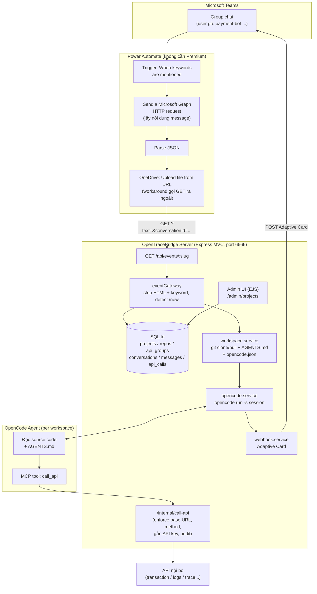
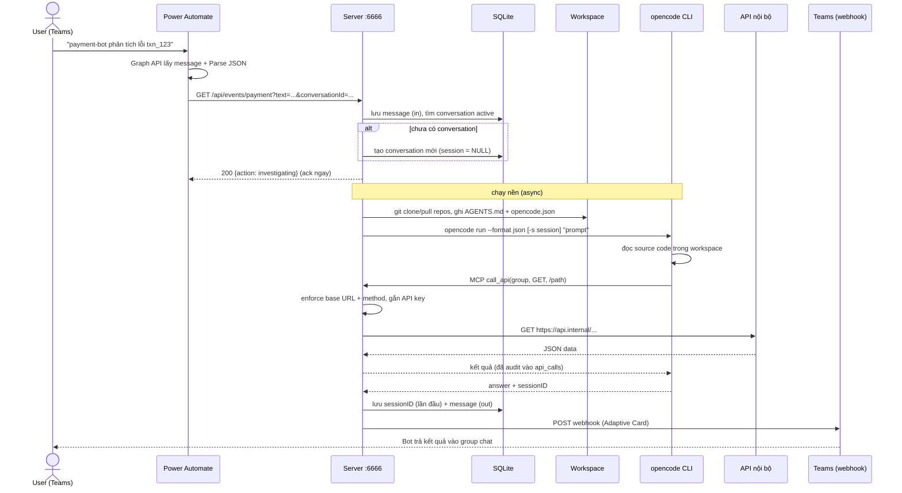
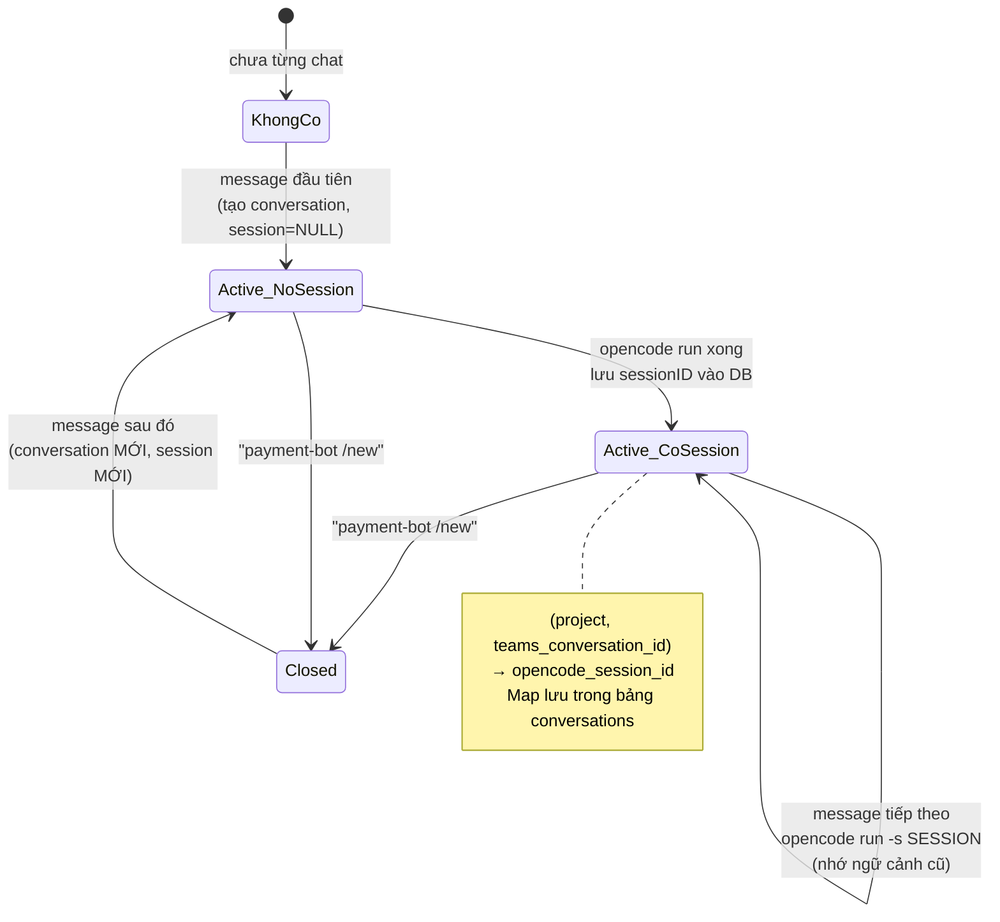
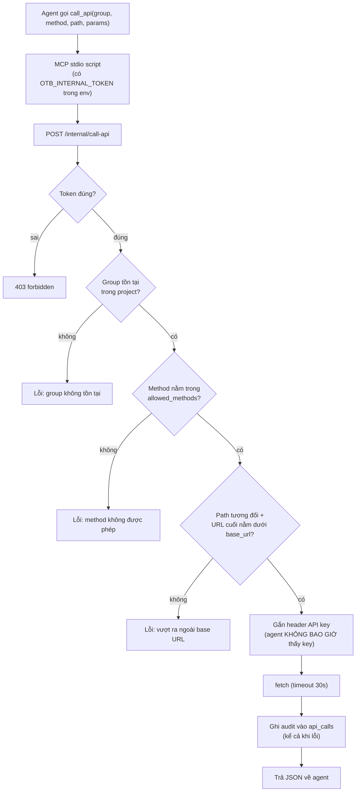
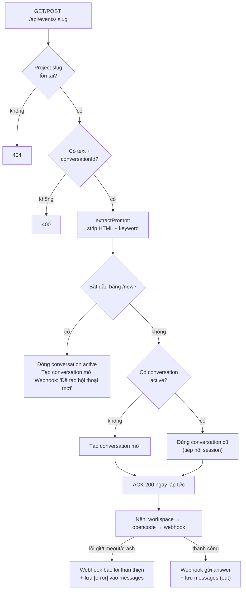

# OpenTraceBridge — Flow Diagrams

## 1. Kiến trúc tổng thể

## 2. Sequence: một câu hỏi điều tra từ Teams

## 3. Vòng đời conversation & session (lệnh /new)

## 4. Enforcement khi agent gọi API (call_api)

## 5. Luồng xử lý request trong server (điểm rẽ nhánh)

