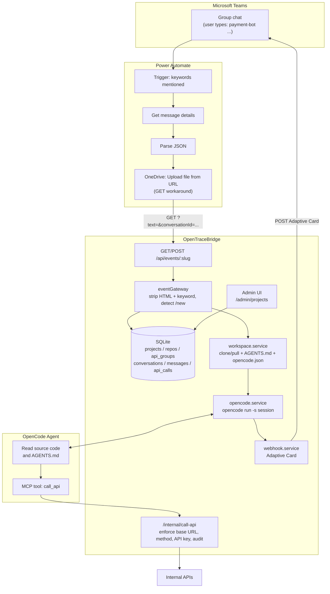
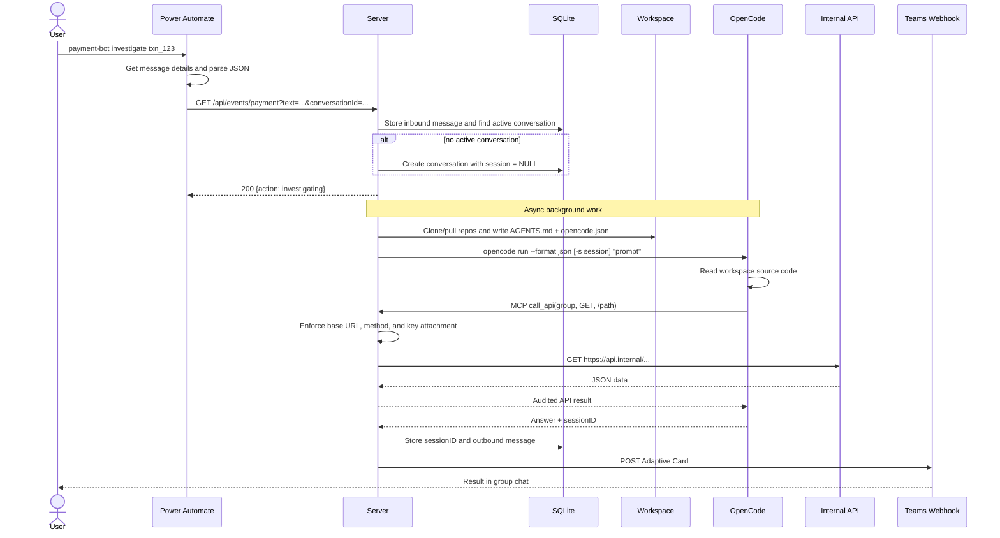
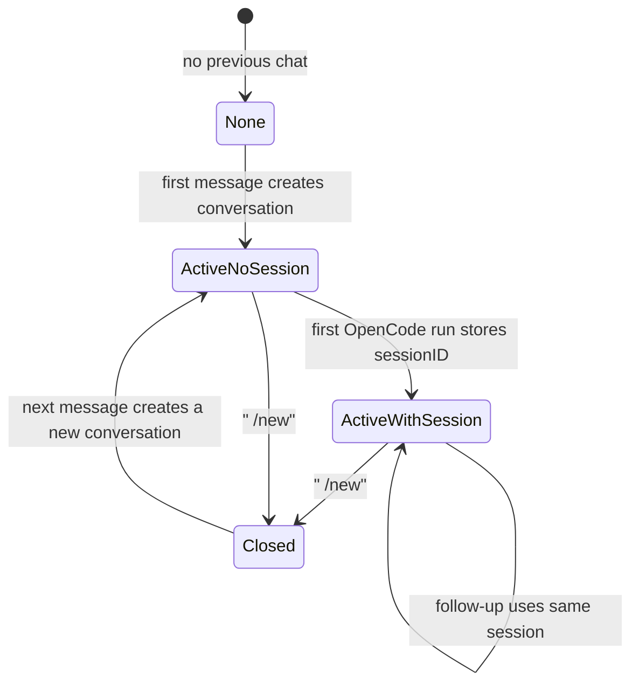
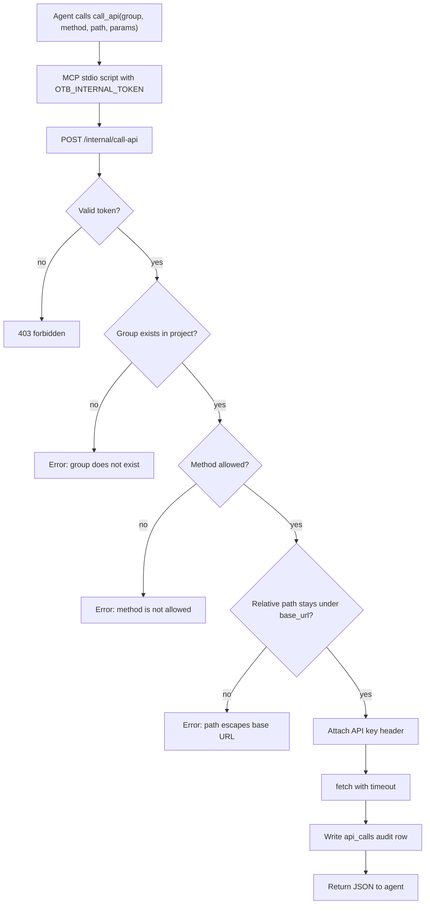

# OpenTraceBridge Flow Diagrams

## Overall Architecture

```mermaid
flowchart TB
    subgraph TEAMS["Microsoft Teams"]
        GC["Group chat<br/>(user types: payment-bot ...)"]
    end

    subgraph PA["Power Automate"]
        TR["Trigger: keywords mentioned"]
        GR["Get message details"]
        PJ["Parse JSON"]
        UP["OneDrive: Upload file from URL<br/>(GET workaround)"]
        TR --> GR --> PJ --> UP
    end

    subgraph SRV["OpenTraceBridge"]
        EV["GET/POST /api/events/:slug"]
        GW["eventGateway<br/>strip HTML + keyword, detect /new"]
        DB[("SQLite<br/>projects / repos / api_groups<br/>conversations / messages / api_calls")]
        ADM["Admin UI<br/>/admin/projects"]
        WS["workspace.service<br/>clone/pull + AGENTS.md + opencode.json"]
        OC["opencode.service<br/>opencode run -s session"]
        IN["/internal/call-api<br/>enforce base URL, method, API key, audit"]
        WH["webhook.service<br/>Adaptive Card"]
        EV --> GW --> DB
        GW --> WS --> OC
        OC --> WH
        ADM --> DB
    end

    subgraph AGENT["OpenCode Agent"]
        AG["Read source code<br/>and AGENTS.md"]
        MCP["MCP tool: call_api"]
        AG --> MCP
    end

    EXT["Internal APIs"]

    GC --> TR
    UP -- "GET ?text=&conversationId=..." --> EV
    OC <--> AG
    MCP --> IN --> EXT
    WH -- "POST Adaptive Card" --> GC
```

## Investigation Sequence

```mermaid
sequenceDiagram
    actor U as User
    participant PA as Power Automate
    participant S as Server
    participant DB as SQLite
    participant W as Workspace
    participant O as OpenCode
    participant A as Internal API
    participant T as Teams Webhook

    U->>PA: payment-bot investigate txn_123
    PA->>PA: Get message details and parse JSON
    PA->>S: GET /api/events/payment?text=...&conversationId=...
    S->>DB: Store inbound message and find active conversation
    alt no active conversation
        S->>DB: Create conversation with session = NULL
    end
    S-->>PA: 200 {action: investigating}

    Note over S,O: Async background work
    S->>W: Clone/pull repos and write AGENTS.md + opencode.json
    S->>O: opencode run --format json [-s session] "prompt"
    O->>O: Read workspace source code
    O->>S: MCP call_api(group, GET, /path)
    S->>S: Enforce base URL, method, and key attachment
    S->>A: GET https://api.internal/...
    A-->>S: JSON data
    S-->>O: Audited API result
    O-->>S: Answer + sessionID
    S->>DB: Store sessionID and outbound message
    S->>T: POST Adaptive Card
    T-->>U: Result in group chat
```

## Conversation State

```mermaid
stateDiagram-v2
    [*] --> None: no previous chat
    None --> ActiveNoSession: first message creates conversation
    ActiveNoSession --> ActiveWithSession: first OpenCode run stores sessionID
    ActiveWithSession --> ActiveWithSession: follow-up uses same session
    ActiveWithSession --> Closed: "<keyword> /new"
    ActiveNoSession --> Closed: "<keyword> /new"
    Closed --> ActiveNoSession: next message creates a new conversation
```

## API Enforcement

```mermaid
flowchart TD
    A["Agent calls call_api(group, method, path, params)"] --> B["MCP stdio script with OTB_INTERNAL_TOKEN"]
    B --> C["POST /internal/call-api"]
    C --> D{"Valid token?"}
    D -- "no" --> X1["403 forbidden"]
    D -- "yes" --> E{"Group exists in project?"}
    E -- "no" --> X2["Error: group does not exist"]
    E -- "yes" --> F{"Method allowed?"}
    F -- "no" --> X3["Error: method is not allowed"]
    F -- "yes" --> G{"Relative path stays under base_url?"}
    G -- "no" --> X4["Error: path escapes base URL"]
    G -- "yes" --> H["Attach API key header"]
    H --> I["fetch with timeout"]
    I --> J["Write api_calls audit row"]
    J --> K["Return JSON to agent"]
```
